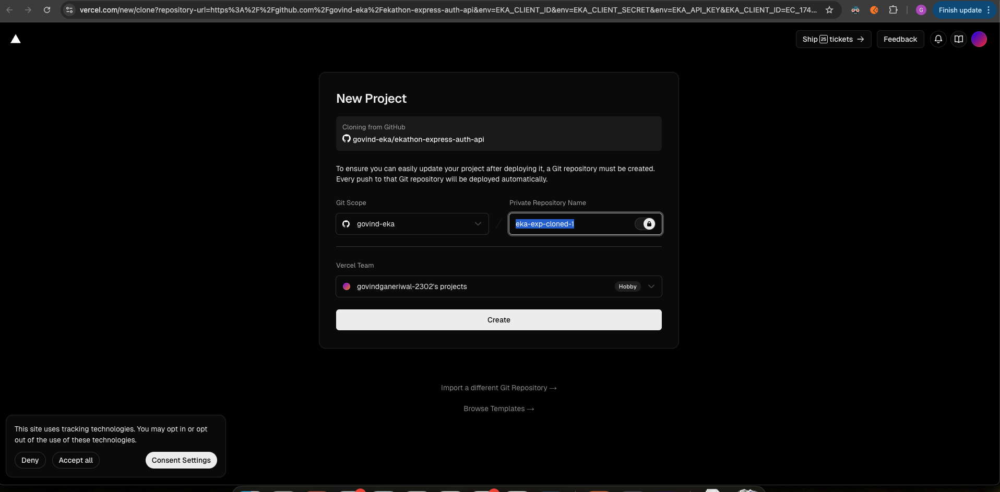
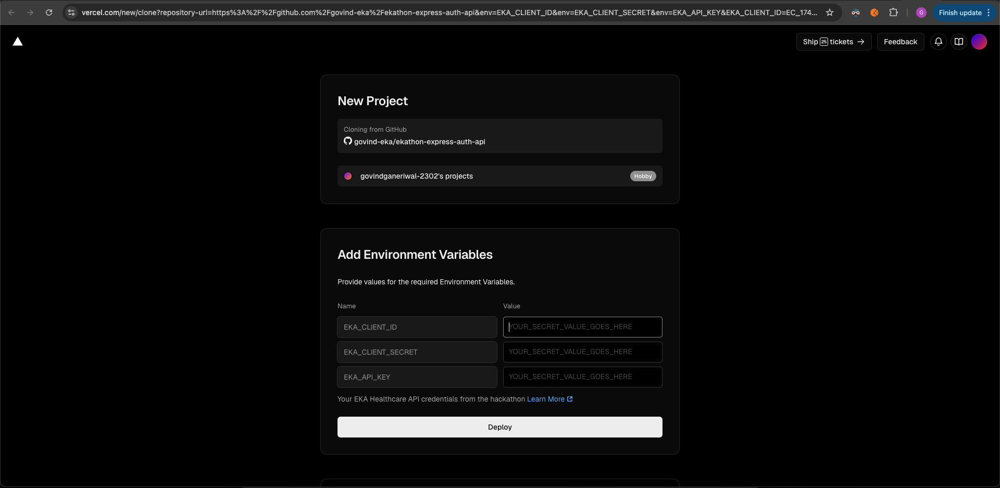

# EKA Healthcare Auth Proxy - Express.js

repo to be used if participants decide to use eka care's SDK on FE directly
obtain your client ID, client secret and API key and paste them in the below URL and click on the `deploy` button. that makes a repo in your vercel account, and will clone this repo and deploy, and then when initing the SDK on a FE client side app you can use this domain and api route. (more on that, link)

## 🚀 One-Click Deploy

- obtain your client ID, client

[](https://vercel.com/new/clone?repository-url=https%3A%2F%2Fgithub.com%2Fgovind-eka%2Fekathon-express-auth-api&env=EKA_CLIENT_ID,EKA_CLIENT_SECRET,EKA_API_KEY&envDescription=Your%20EKA%20Healthcare%20API%20credentials%20from%20the%20hackathon&envLink=https%3A%2F%2Fdeveloper.eka.care%2Fapi-reference%2F)

- after clicking on the button you will be taken to this kind of a UI, where you can clone the repo and deploy


- click the create button

- you are now prompted to enter your credientials that got stored as env vars in your own vercel account and these credientials are used in the `api/manage-auth` route

fill the respective values and click deploy


## 📋 Usage

After deployment, use your Vercel URL in the EKA SDK, on Frontend:

```js
const eka = createEkaInstance({
  source: "FE",
  auth_token: "initial-token",
  refresh_token: "initial-refresh",
  refreshTokenFN: myRefreshFn, // this is provided, in the NPM docs, you may copy it and use it on your FE apps
  backendAuthEndpointURL: "https://URL-that-vercel-gives-you/api/manage-auth",
});
```
